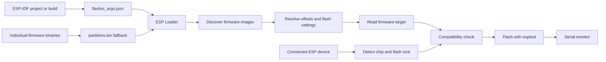

# ESP Loader

A Windows and Linux desktop application for flashing, inspecting, and diagnosing Espressif devices.

- Opens an ESP-IDF project or build and reconstructs its flash layout from `flasher_args.json`.
- Detects the connected chip and flash size, then checks the firmware target against the hardware.
- Parses ESP-IDF partition tables and resolves image offsets when build metadata is unavailable.
- Keeps every image, offset, and flash parameter visible and editable before writing.
- Combines flashing, erase, production-package handling, a serial monitor, and serial plotting in one workflow.

ESP Loader uses Espressif's `esptool` as its device communication and flashing engine. Its purpose is to understand build outputs, validate the operation, and make the complete flash layout reviewable before invoking that engine.

> **No public binary release is available yet.** The application currently runs from source. Windows packaging, a Linux AppImage, broader hardware validation, and licensing are still in progress.

## Project Status

ESP Loader is under active development and has not reached a public stable release.

### Working

- Windows and Linux desktop application UI.
- Serial-port enumeration.
- Non-destructive chip and flash-size detection through `esptool flash-id`.
- ESP-IDF import from `build/flasher_args.json`, including images in `bootloader/` and `partition_table/`.
- PlatformIO import from the newest compiled environment and `idedata.json` when available.
- Arduino exported-binary and generic Espressif build discovery.
- Binary ESP-IDF partition-table parsing and application-offset matching.
- Manual image selection, enablement, removal, and offset editing.
- Editable flash mode, frequency, size, baud, and chip.
- Firmware-target and connected-chip compatibility checks.
- Multi-image flashing and full-chip erase through esptool 4 or 5.
- Validation of files, addresses, flash capacity, and overlapping 4 KiB erase sectors.
- Command preview, live technical output, per-image progress, cancellation, and operation timeouts.
- Import and export of integrity-checked ESP Loader production ZIP packages.
- Portable persistence of the selected project and flash-image list.

The real flash and erase workflows passed physical-device testing on Linux on September 6, 2026. Automated tests cover their validation, command construction, process lifecycle, and UI transitions.

### In development

- The serial monitor has real I/O, configurable 7/8 data bits, 1/2 stop bits, parity, TX terminators, reset control, filtering, prefix tabs, copy, and log saving. Automatic USB reconnection and broader hardware/Windows testing remain.
- Flash/monitor coordination releases an active serial port before a device operation and can reopen it afterward. More hardware testing remains.
- Autoload watches stable changes to enabled images and project metadata, queues changes detected during flashing, and refreshes project metadata before an automatic write. Hardware validation remains.
- Serial plotting consumes explicit `PLOT:` records, supports a compatibility prefix filter, discovers recurring numeric variables, and acquires up to eight selected series. Zoom, configurable time windows, persistence, and hardware validation remain.
- The Settings page changes the theme. Its esptool-path field is currently a placeholder and does not configure tool discovery.
- Windows runtime verification and per-family physical-device coverage are incomplete.

### Planned

- Automatic serial reconnection after USB removal.
- Persisted serial, monitor, plot, theme, and window settings.
- Linux AppImage and portable Windows package.
- Bundled, licensed Espressif tooling with startup dependency checks.
- Plot zoom, configurable time windows, and configurable input formats.
- Reusable profile import/export and optional combined firmware images.

See [ROADMAP.md](ROADMAP.md) for the planned milestones and remaining validation.

## Why ESP Loader?

`esptool` remains the reference tool that communicates with Espressif chips. ESP Loader does not replace it. ESP Loader builds a safer, more inspectable desktop workflow around it.

The intended workflow is: **drop/open an ESP-IDF build and let ESP Loader determine what needs to be flashed.** Instead of reducing flashing to one button, the application reconstructs and exposes:

- the firmware images;
- their offsets;
- the partition layout;
- the firmware target;
- flash mode, frequency, and size;
- compatibility with the connected device.

The operator can inspect and change those values before starting the write, preview the generated command, and retain the complete esptool output.

## Workflow



1. Connect the Espressif device.
2. Select its serial port and press **Test**. This runs a non-destructive `flash-id` query.
3. Press **Select project folder** and choose an ESP-IDF project root, or select individual `.bin` files.
4. Review the imported images, offsets, firmware target, and flash configuration.
5. Press **Test** again if the firmware was imported after device detection. Programming is disabled when the detected chip and firmware target differ.
6. Use **Preview command** to validate the request and inspect the canonical command without accessing the device.
7. Press **Program**. The current image progress and full esptool output are retained in the application session.
8. Open **Monitor** and connect to the serial port. If it was already connected before flashing, **Monitor after flashing** can reopen it automatically.

## ESP-IDF Build Import

When **Select project folder** receives a directory containing `CMakeLists.txt`, ESP Loader expects a compiled ESP-IDF project at `build/flasher_args.json`. If the manifest is absent, it reports that the project must be built first.

From `flasher_args.json`, ESP Loader reads:

- every entry in `flash_files`, preserving the address and resolving relative paths from the build directory;
- the chip target from `extra_esptool_args.chip`;
- flash mode, frequency, and size from `flash_settings` when present;
- binaries stored directly in the build directory or in subdirectories such as `bootloader/` and `partition_table/`.

The manifest is authoritative when present. ESP Loader does not guess replacements for manifest addresses.

When an individual `bootloader.bin` is selected, ESP Loader searches that directory and up to five parent levels for `flasher_args.json`. If no manifest is found, it imports sibling `.bin` files. If a binary partition table is present, it:

- reads its partition entries;
- matches binary filenames to partition labels;
- prefers the factory application partition, then the first OTA application partition, for the largest unresolved application image.

Without authoritative metadata, the following are editable suggestions:

- bootloader: `0x1000` for ESP32 and `0x0000` for the other selectable families;
- partition table: `0x8000`;
- `boot_app0.bin`: `0xE000`;
- application image: `0x10000` when it cannot be matched to a partition.

Device detection also resets the flash mode to DIO, selects 80 MHz for ESP32-S3, ESP32-C5, ESP32-C6, and ESP32-P4, and selects 40 MHz for the other recognized families. These are application recommendations, not values read from the firmware. The detected flash size is used when esptool reports it; otherwise capacity remains set to Detect.

## Other Build Inputs

- **PlatformIO:** detects `platformio.ini`, chooses the most recently modified compiled environment containing `firmware.bin`, and uses `idedata.json` flash images and application offset when available. Its fallback values and filename-based offsets are suggestions.
- **Arduino:** detects a root `.ino` file and searches up to five directory levels for exported `.ino.bin` output, then imports recognized sibling images.
- **Generic Espressif build:** searches up to five directory levels for the newest `flasher_args.json`.
- **ESP Loader production package:** opens a folder or ZIP containing `production_manifest.json`, rejects unsafe ZIP paths, and verifies image size and SHA-256 before import.

## Supported Devices

The following targets are recognized consistently by connection detection, manifest normalization, the chip selector, compatibility validation, and flash/erase command construction:

| Family | Detection parser | ESP-IDF target check | Flash/erase command | Physical coverage |
| --- | --- | --- | --- | --- |
| ESP32 | Yes | Yes | Yes | Not documented per family |
| ESP32-S2 | Yes | Yes | Yes | Not documented per family |
| ESP32-S3 | Yes | Yes | Yes | Not documented per family |
| ESP32-C2 | Yes | Yes | Yes | Not documented per family |
| ESP32-C3 | Yes | Yes | Yes | Not documented per family |
| ESP32-C5 | Yes | Yes | Yes | Not documented per family |
| ESP32-C6 | Yes | Yes | Yes | Not documented per family |
| ESP32-H2 | Yes | Yes | Yes | Not documented per family |
| ESP32-P4 | Yes | Yes | Yes | Not documented per family |
| ESP8266 | Yes | Yes | Yes | Not documented per family |

Recognition means ESP Loader accepts the target and delegates the operation to the installed esptool. It does not mean every family has completed physical-device validation. Support also depends on the esptool version installed on the host.

## Serial Monitor

The monitor performs real serial communication on Windows and Linux. It supports configurable baud rate, 7/8 data bits, 1/2 stop bits, no/even/odd parity, UTF-8 line reconstruction, TX with no terminator/LF/CRLF, and DTR/RTS reset.

The buffer retains up to 10,000 lines. Pause freezes the visible snapshot while reception continues. Search and comma-separated exclusions affect the displayed view. ESP-IDF log tags and `TAG: ...` prefixes are learned from incoming lines; selected tags receive stable live tabs. **Copy visible** copies the selected filtered view, while **Save** writes the complete buffer.

Unexpected device removal is reported, but automatic reconnection is not implemented.

## Serial Plot Protocol

By default the plot accepts only records with the exact `PLOT:` prefix:

```text
PLOT: temperature:28.56°C, humidity:52.44%
PLOT: motor_right:1200rpm, motor_left:1180rpm
```

A field is proposed only after the same name appears twice within five seconds. Select up to eight proposed fields to begin storing samples. Each selected series retains 600 samples; deselecting it clears its history. Discovery and pending candidates are capped at 64 fields each.

Compatibility mode accepts an explicit, case-sensitive list of legacy prefixes such as `tRH, RPM`. Compatibility series use `prefix / field` names to avoid collisions. Pause stops discovery and acquisition, and samples received while paused are not replayed. The plot format and settings are not yet configurable or persisted.

## Installation

### Prebuilt binaries

Prebuilt releases are not available yet. Future GitHub Releases are expected to provide:

- a portable Windows package;
- a Linux AppImage;
- release notes and checksums.

### Run from source

Requirements:

- Flutter with Windows or Linux desktop support;
- the native compiler and desktop dependencies required by Flutter for the selected platform;
- Python with `pip` available on `PATH`; ESP Loader can install or update
  `esptool` automatically for the current user when device detection needs it;
- permission to access the selected serial port.

On Linux, serial access commonly requires membership in the `dialout` group. Follow the Flutter desktop setup instructions for your distribution before building.

```bash
git clone https://github.com/GianluViv/esp_loader.git
cd esp_loader
flutter pub get
flutter run -d linux
```

On Windows, run the equivalent commands from PowerShell or a developer shell:

```powershell
git clone https://github.com/GianluViv/esp_loader.git
cd esp_loader
flutter pub get
flutter run -d windows
```

### esptool discovery

For device detection, ESP Loader tries these commands in order:

| Windows | Linux |
| --- | --- |
| `esptool.exe` | `esptool` |
| `esptool.py` | `esptool.py` |
| `py -m esptool` | `python3 -m esptool` |
| `python -m esptool` |  |

Before flash or erase, ESP Loader probes the same candidates with `version` and requires esptool 4 or newer. If the Python module is missing, **Test** installs it with `pip --user` and retries once. It translates command and flash-option names for esptool 4's underscore syntax. Bundled esptool binaries are planned but are not part of the repository today.

## Safety

- Firmware built for the wrong target may leave a device temporarily unable to boot. ESP Loader blocks a known firmware/device mismatch, but the operator should still verify the selected target and flash parameters.
- **Erase flash** removes firmware, NVS data, credentials, calibration/configuration data stored in flash, and any other flash-resident content. Its confirmation names the selected device.
- Incorrect offsets can overwrite the bootloader, partition table, application, or data partitions. Manifest addresses take precedence; fallback addresses remain editable suggestions and should be reviewed.
- Stop and timeout terminate the host process, but cannot undo bytes already erased or written. Program the device again before relying on it.
- With flash size set to Detect or Keep, capacity validation is delegated to esptool. ESP Loader does not add esptool's force option.

## Screenshots

Screenshots will be added before the first public release. The planned set is:

- programming window;
- chip and flash-size detection;
- automatic ESP-IDF build import;
- serial monitor and plot.

No image paths are referenced yet, so the README remains complete in clones without screenshot assets.

## Development

The main entry point is `lib/main.dart`. Device/process, project import, firmware manifest, partition table, production package, serial, profile, and plot parsing logic live in separate files under `lib/`. See [docs/ARCHITECTURE.md](docs/ARCHITECTURE.md) for responsibilities and data flow.

```bash
flutter analyze
flutter test
```

Automated tests cover chip and flash-size output parsing; `flasher_args.json`; PlatformIO, ESP-IDF, Arduino, and production-package imports; binary partition tables; image addresses and overlap/capacity validation; firmware-target mismatches; esptool 4/5 command construction; progress parsing; process failure, timeout, and cancellation; serial buffering and controls; portable profiles; plot parsing and discovery; and primary widget state transitions.

Automated tests do not replace Windows runtime testing, USB removal/reconnection tests, or physical tests across every listed chip family. Those gaps are tracked in the roadmap.

## Contributing and Security

See [CONTRIBUTING.md](CONTRIBUTING.md) before opening a pull request. Please report security-sensitive issues according to [SECURITY.md](SECURITY.md).

## License

This repository does not currently contain a license. Consequently, public visibility alone does not grant permission to use, modify, or redistribute the code. An explicit open-source license must be selected before public promotion; MIT is the suggested default if broad reuse is the goal.

## Releases

There are no official releases yet. When packages are ready, this section should link directly to GitHub Releases and list the application version, Windows and Linux artifacts, release notes, and SHA-256 checksums. Until then, the version in application metadata should not be interpreted as a published stable release.

On Windows, `release.bat` builds and copies the complete Flutter bundle to
`release\`. When Enigma Virtual Box is installed, it also creates the single-file
`release_portable\esp_loader.exe`; otherwise the regular bundle remains usable.

See [CHANGELOG.md](CHANGELOG.md) for unreleased development changes and [docs/PUBLISHING.md](docs/PUBLISHING.md) for the proposed GitHub description, topics, screenshot checklist, and release checklist.
