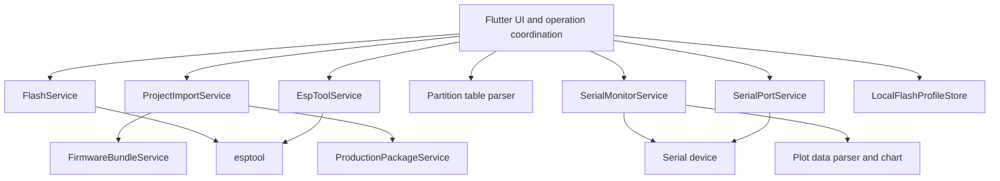

# ESP Loader Architecture

## Overview

ESP Loader is a Flutter desktop application for Windows and Linux. The UI coordinates several small Dart services that inspect build output, validate a flash layout, invoke esptool, and communicate with serial devices.

## Runtime flow

`lib/main.dart` is the Flutter entry point and currently owns navigation, page state, and cross-page coordination. The programming page imports build metadata, holds the editable flash-image table, compares firmware and detected targets, validates user actions, and suspends/reopens the monitor around device operations.

The architecture does not yet have the central operation state machine proposed for a later milestone. State remains primarily inside the Flutter page objects, while reusable parsing and I/O behavior is separated into services.

## Components

### Device discovery

`lib/serial_port_service.dart` enumerates native serial ports and supplies display metadata to the programming and monitor pages.

`lib/esptool_service.dart` runs `flash-id`, captures stdout and stderr, applies a 20-second timeout, and extracts the recognized chip and flash size. This query is non-destructive.

### Build and firmware parsing

`lib/project_import_service.dart` classifies selected folders as ESP-IDF, PlatformIO, Arduino, generic Espressif, or ESP Loader production packages. It chooses the relevant build directory and returns a normalized firmware bundle.

`lib/firmware_bundle_service.dart` parses ESP-IDF `flasher_args.json`. It resolves relative image paths, preserves flash addresses, and normalizes target and flash settings.

`lib/partition_table.dart` decodes fixed-size entries from the ESP-IDF binary partition-table format. The programming page uses labels, types, subtypes, offsets, and image filenames to resolve otherwise unknown application offsets.

`lib/production_package_service.dart` exports a versioned JSON manifest and binaries to ZIP. Import validates the format, rejects unsafe archive paths, and checks every binary's size and SHA-256 digest.

### Flash operations

`lib/flash_service.dart` owns request validation, esptool 4/5 discovery, version-specific argument conversion, subprocess output, per-image progress parsing, a ten-minute default timeout, and cancellation. Only one flash/erase operation can run through a service instance at a time.

Validation checks the selected port, baud, accepted chip identifier, firmware/device target match, flash options, file existence/readability/size, address range, selected capacity, and overlapping 4 KiB erase sectors. esptool retains final authority over communication and hardware protections.

### Serial and plotting

`lib/serial_monitor_service.dart` wraps `flutter_libserialport`, configures the connection, reconstructs UTF-8 lines, transmits text, pulses DTR/RTS for reset, and reports disconnects. The monitor page owns its bounded display buffer, filters, learned prefixes, and log tabs.

`lib/plot_data_parser.dart` extracts numeric `Name: value` fields from allowed serial prefixes. The plot page applies recurring-field discovery, selection limits, sample retention, pause behavior, and drawing.

### Local state

`lib/local_profile_service.dart` stores image paths, offsets, enabled states, and the selected project in `esp_loader_profile.json`. The file is placed beside the resolved executable, or beside the original AppImage through its `APPIMAGE` environment path. Broader settings persistence is planned.

## Repository layout

| Path | Purpose |
| --- | --- |
| `lib/` | Flutter UI, services, parsers, and domain data |
| `test/` | Unit, subprocess, and widget tests |
| `windows/` | Flutter Windows runner and native icon resources |
| `linux/` | Flutter Linux runner, desktop entry, and icon integration |
| `docs/` | Maintainer and architecture documentation |

## Testing boundaries

Unit tests use temporary files and injected process/serial implementations to cover deterministic behavior. Subprocess tests exercise output draining, failure, timeout, and termination on Linux. Widget tests cover important UI state transitions.

Hardware behavior, driver behavior, USB removal, timing under real builds, and cross-family boot/flash behavior require separate physical validation. Test results should record the OS, board, chip, connection method, esptool version, and operation performed.
